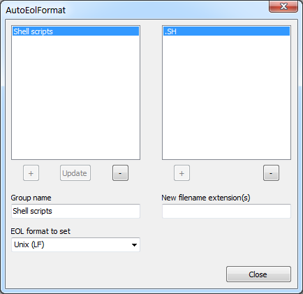

# AutoEolFormat plugin for Notepad++

Builds for 32 and 64 bits Notepad++ installations available

Author: Andreas Heim, 2018

# Features

This plugin allows you to create file classes which are defined by related filename extensions. For every file class you have to provide the EOL (End of Line) format to which should be switched to when the plugin detects that the active Notepad++ document is a member of this file class.

# How it works

The plugin captures the following events in Notepad++:

  * A file is loaded, saved, or renamed.
  * The active tab of Notepad++ is changed.
  * A file is closed or deleted (only for internal management).
  * Notepad++ shuts down (only for internal management).

When one of these events fires the plugin gets invoked. In the former two cases, after it has verified the membership to a certain file class it converts the EOL format of the active document to the format of this file class, according to your settings.

**Note**: Files are not automatically saved after the EOL format has been converted by the plugin, you are always able to discard the changes by reloading the file.

# Manual installation

1. Download the latest release. If you run a 32 bits version of Notepad++ take the file "AutoEolFormat_vX.X_UNI.zip". In case of a 64 bits version take the file "AutoEolFormat_vX.X_x64.zip".
2. Unzip the downloaded file to a folder on your harddisk where you have write permissons.
3. Copy the file "WinXX\AutoEolFormat.dll" to the "plugins" directory of your Notepad++ installation. You can find the "plugins" directory under the installation path of Notepad++.
4. Copy the file "AutoEolFormat.txt" to the directory "plugins\doc". If it doesn't exist create it.

# History

v1.0 - October 2018
* Initial version
